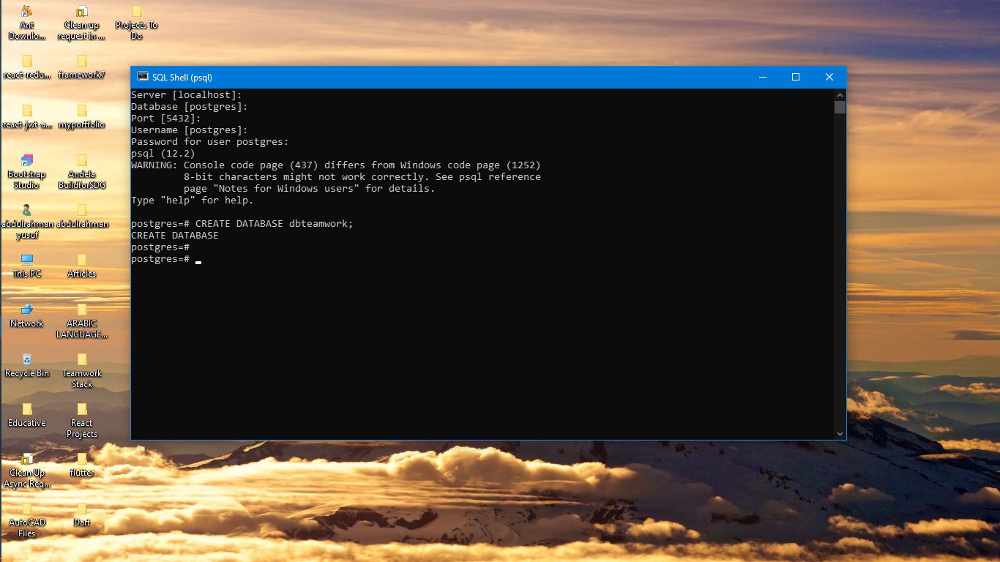
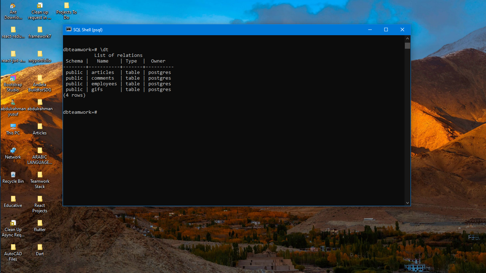
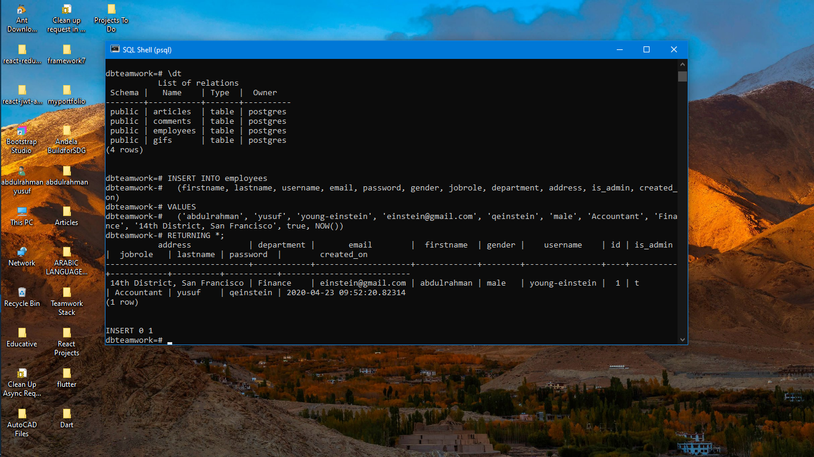
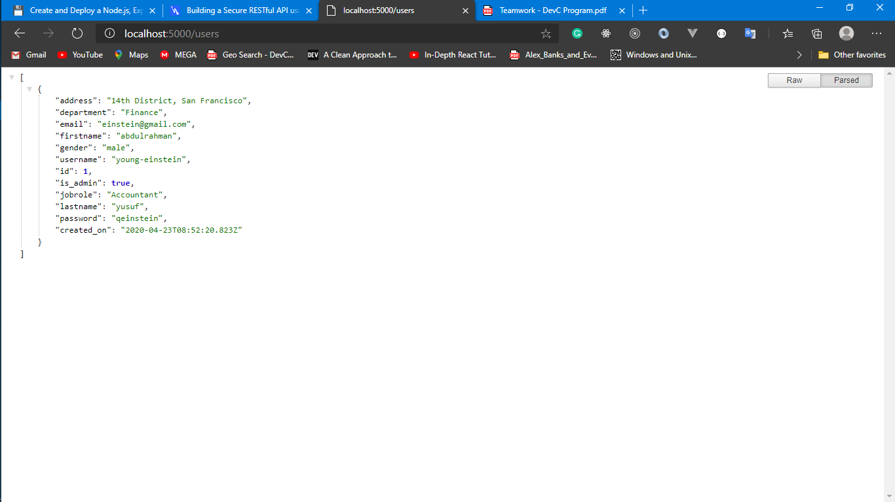

# Building a RESTful API using Express, NodeJS and PostgreSQL

This tutorial will be a series based one which will be updated at least twice every week in order to enhance my Techical Writing Skills and also explain a few core concepts to whomever might be needing a tutorial like this.  

## Technologies

Below are the tools and technologies we would be using for building our RESTful API

NodeJS  - Node.js is an open-source, cross-platform JavaScript run-time environment that executes JavaScript code outside of a browser. Basically, we would be using this to run our javascript code on the server.

Express  - This is a web application framework for Node.js which we would be using as a server for our API's.

PostgreSQL  - This is an open source object-relational database system which we would be using to save our bookstore content.

Postman  - A Chrome app that we'll be using to test our API.

ES6 - ES6, officially known as ECMAScript 2015, is a scripting-language specification standardized created to standardize JavaScript.

VS Code  - is a powerful IDE for modern JavaScript development.

## Prerequisites

- Basic Knowledge of Javascript
- Postgres and Node.js installed on your machine

## Getting Started

To get started with building our RESTful API, we need to initialize our project directory. Move into the new directory and initialize NodeJS by running the command below

    cd your-project-folder
    npm init -y

This would create a package.json file in our directory.

##### Setting up our Express Server

To create our express application, we need to install express alongside some other packages

    npm install express body-parser cors bcryptjs pg --save

Create a server.js file, which we’ll use as the entry point for our server and paste in the following code. 

    const http = require('http');
    const app = require('./app');

    app.set('port', process.env.PORT || 5000);

    const server = http.createServer(app);
    const port = process.env.PORT || 5000
    server.listen(port);
    console.log(`Server running on port ${port}`);

    module.exports = server;

Dont' get scared, I'll explain what's going on:

- We imported the http module using the 'require' keyword which is an inbuilt javasript method for importing files

- We then declared a variable called 'app' which we imported from a different file called app (we'll create that in a moment)

- Then we set our port using the set method gotten from our app which we imported above

Now create another file called <app.js> and paste in the following code: 

    const express = require('express')
    const bodyParser = require('body-parser')
    const app = express()

    app.use(bodyParser.json())
    app.use(bodyParser.urlencoded({
        extended: true,
      })
    )

    app.get('/', (request, response) => {
      response.json({ info: 'Node.js, Express, and Postgres API' })
    })

    module.exports = app;
    
- At the top, we’ll require the express module, built in bodyParser middleware, and set our app and port variables.

From the command line, we can start the server by:

    node server.js
    Server running on port 5000

Typing `node server.js` everytime we make changes in our files is stressful and as programmers, we should learn to automate things for faster results and time efficiency. We need to install nodemon to restart our server whenever we make changes to any of our file.

    npm install --save-dev nodemon

To use nodemon, open the package.json file and update the scripts section to the code below

    "scripts": {
        "start": "node server.js",
        "dev": "nodemon server.js"
      }

Now we can run our application with nodemon command.   
    
    npm run dev

This will automatically restart our server whenever any changes are made in our files.

#### Setting up our folder structure

Before we continue, I would like us to create some folders which we're going to be using for our project, our project structure would be like this: 

    - controllers
    - middleware
    - models
    - routes

#### Creating Our Postgres Database

Launch the psql command shell on your PC, follow the instructions shown then enter the default postgres credentials used during its installation. Once you are logged in, type in the following to create a database then press enter:
    
    CREATE DATABASE dbteamwork;

Your response should be like the message in the screenshot below

Now to connect to the Database which we just created, type in your shell, you should get a message saying `You are now connected to database "dbteamwork" as user "postgres`.

    \c dbteamwork

We will be creating tables in our database where our data gotten from the Client-Side will be persisted. The number of tables created will be determined based on the relatonship between the data that will be persisted. Before creating our tables, let's quickly take a short visit back to our Project Objectives which are listed below: 

- Admin can create an employee user account.
- Admin/Employees can sign in.
- Employees can post gifs.
- Employees can write and post articles.
- Employees can edit their articles.
- Employees can delete their articles.
- Employees can delete their gifs post.
- Employees can comment on other colleagues' article post.
- Employees can comment on other colleagues' gif post.
- Employees can view all articles and gifs, showing the most recently posted articles or gifs first.
- Employees can view a specific article.
- Employees can view a specific gif post.

Looking at the objectives of our App above, we can deduce that the following tables will be needed: 

- Employees (users)
- Articles
- Gifs
- Comments

Going back to our psql shell, we will paste in the following queries to create our tables

    CREATE TABLE employees (
        address VARCHAR(255) NOT NULL,
        department VARCHAR(255) NOT NULL,
        email VARCHAR(255) UNIQUE NOT NULL,
        firstname VARCHAR(25) NOT NULL,
        gender VARCHAR(15) NOT NULL,
        username VARCHAR(255) UNIQUE NOT NULL,
        id SERIAL UNIQUE PRIMARY KEY,
        is_admin boolean NOT NULL DEFAULT FALSE,
        jobrole VARCHAR(255) NOT NULL,
        lastname VARCHAR(25) NOT NULL,
        password VARCHAR(255) NOT NULL,
        created_on TIMESTAMP
    );

    CREATE TABLE articles (
        article_id SERIAL UNIQUE PRIMARY KEY,
        title VARCHAR(255) NOT NULL,
        body VARCHAR NOT NULL,
        author_id INT REFERENCES employees(id) NOT NULL,
        author VARCHAR(30) REFERENCES employees(username) NOT NULL,
        created_on TIMESTAMP NOT NULL
    );

    CREATE TABLE gifs (
        gif_id SERIAL UNIQUE PRIMARY KEY,
        title VARCHAR(255) NOT NULL,
        image_url VARCHAR NOT NULL,
        author_id INT REFERENCES employees(id) NOT NULL,
        author VARCHAR(30) REFERENCES employees(username) NOT NULL,
        created_on TIMESTAMP NOT NULL
    );

    CREATE TABLE comments (
        cid SERIAL UNIQUE PRIMARY KEY,
        comments VARCHAR NOT NULL,
        post_type VARCHAR(15) NOT NULL,
        article_id INT REFERENCES articles(article_id) NOT NULL,
        gif_id INT REFERENCES gifs(gif_id) NOT NULL,
        author_id INT REFERENCES employees(id) NOT NULL,
        created_on TIMESTAMP NOT NULL
    );

Once we are done with that, we type in the shell `\dt` to check if all our tables were created successfully

Before we proceed we need to create a user that will serve as our admin using the following queries

    INSERT INTO employees 
        (firstname, lastname, username, email, password, gender, jobrole, department, address, is_admin, created_on) 
    VALUES 
        ('abdulrahman', 'yusuf', 'young-einstein', 'einstein@gmail.com', 'qeinstein', 'male', 'Accountant', 'Finance', '14th District, San Francisco', true, NOW())
    RETURNING *;

#### Connecting to our Database

We'll be using the pg package we installed earlier to connect and make requests to our database which was created earlier. Create a `.env` file at the root of your project folder, then paste in the following

    DB_USER=postgres
    DB_HOST=localhost
    DB_NAME=dbteamwork
    DB_PASSWORD=password // password used during pasql
    DB_PORT=5432

Go into your 'models' folder and create a file called config.js and paste in the following code: 

    const Pool = require('pg').Pool;
    const dotenv = require('dotenv');

    dotenv.config();

    const connectionString = `postgresql://${process.env.
        DB_USER}:${process.env.DB_PASSWORD}@${process.env.DB_HOST}:${process.env.DB_PORT}/${process.env.DB_NAME}`;

    if (process.env.NODE_ENV === 'production') {
        const pool = new Pool({
            connectionString: process.env.DATABASE_URL
        }) 
    } else if (process.env.NODE_ENV == 'test') {
        const pool = new Pool({
            connectionString: process.env.TEST_DB_URL
        }) 
    } else {
        const pool = new Pool({
            connectionString: connectionString
        }) 
    }

    pool.on('connect', () => {
    console.log('connected to the Database');
    });

    module.exports = pool

Dotenv enables us make use of the variables stored in our `.env` file we created earlier and the `pg` package allow us create a new instance of the pool object which we then insert our Database details. We then export the pool instance at the end of the file so that it can be accessed in other files.

For us to test our Database, we will be importing our pool instance in our `app.js` file we created earlier. We will query our database by getting the list of users in our employees table.

    const express = require('express')
    const bodyParser = require('body-parser')
    const app = express();
    const pool = require('./models/config.js');

    app.use(bodyParser.json());
    app.use(bodyParser.urlencoded({
        extended: true,
      });
    );

    app.get('/', (request, response) => {
    response.json({ info: 'Node.js, Express, and Postgres API' })
    });

    app.get('/users', (request, response) => {
        pool.query('SELECT * FROM employees', (error, results) => {
            if (error) {
                console.log(error)
            }
            response.status(200).json(results.rows)
        });
    })

    module.exports = app;

Then, open your browser and type in this route `http://localhost:5000/users` in your address bar, you should get the response in the screenshot below:

